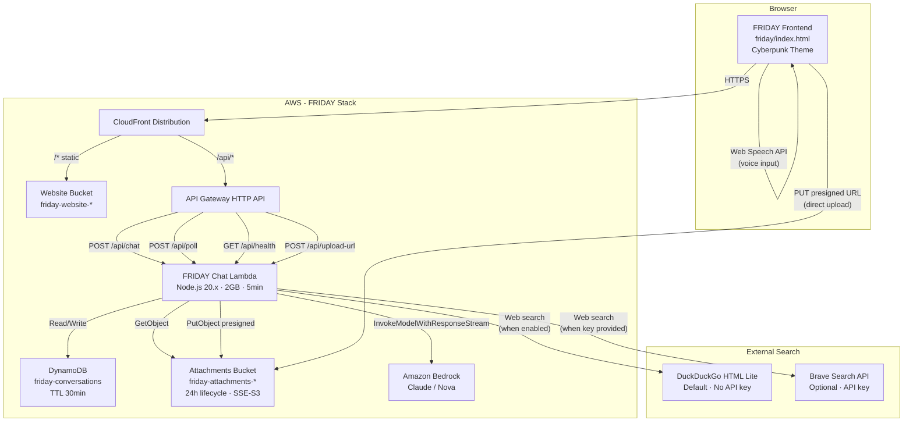
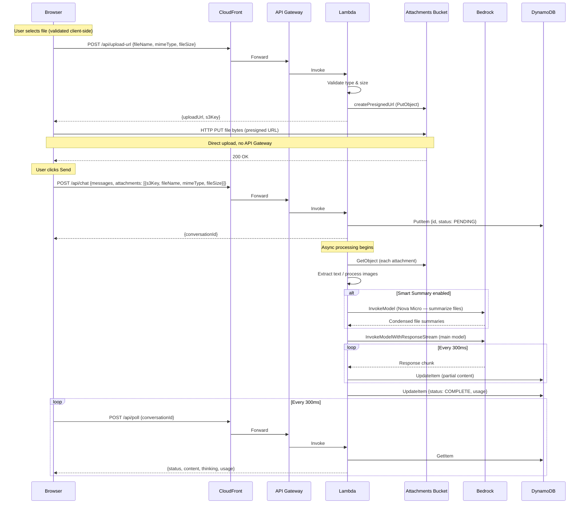
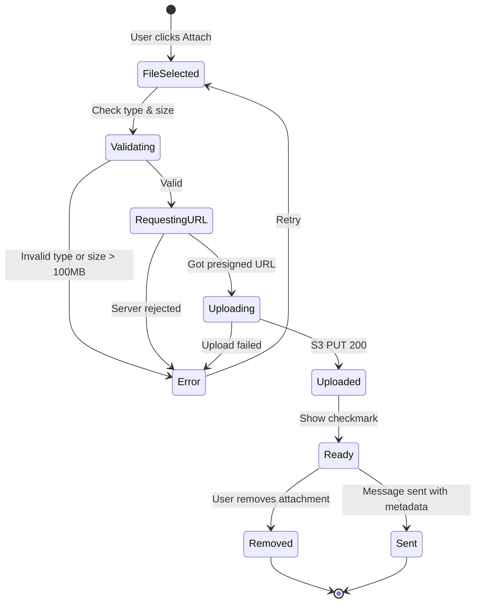
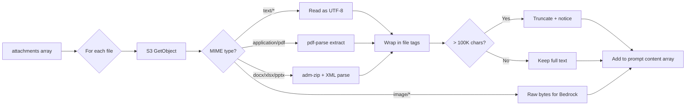
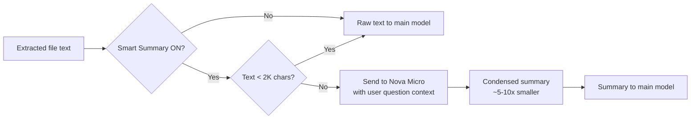
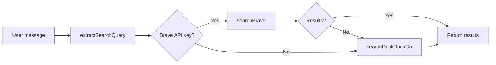
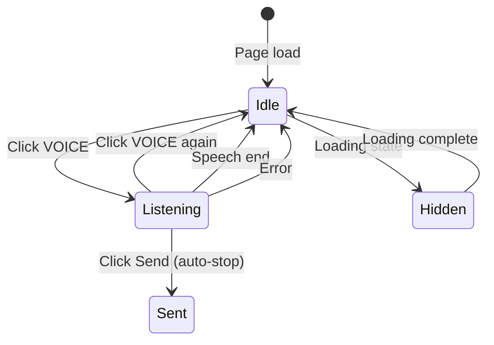

# Design Document: FRIDAY — Cyberpunk AI Chatbot with Web Search, Voice Input, and Large File Attachments

## Overview

FRIDAY is a new, independent cyberpunk-themed AI chatbot application deployed alongside JARVIS. It lives entirely in the `friday/` folder with its own CloudFormation stack, deploy script, and single-page frontend. JARVIS is never modified.

FRIDAY reuses the same serverless architecture pattern as JARVIS (CloudFront → S3 + API Gateway → Lambda → DynamoDB + Bedrock) but adds web search with citations (DuckDuckGo + Brave Search), voice input via the Web Speech API, native support for large file attachments up to 100 MB via presigned URL uploads to a dedicated S3 attachments bucket, and a smart file summarizer. The Lambda retrieves uploaded files, extracts text content (PDF, DOCX, XLSX, PPTX, code, logs, etc.), performs web searches when enabled, and includes all context in the Bedrock prompt so the AI can reason about attached files and cite web sources.

The visual identity is a cyberpunk/terminal HUD aesthetic: near-black backgrounds, neon cyan and lavender accents with glow effects, scanline overlays, glitch animations, monospace fonts, and grid patterns. Message text uses standard readable colors (white in dark mode, dark in light mode) for comfortable reading.

### Key Design Decisions

| Decision | Choice | Rationale |
|----------|--------|-----------|
| Separate stack | Own `friday/cloudformation.yaml` | Zero risk to JARVIS; independent lifecycle |
| DuckDuckGo default search | HTML lite endpoint, no API key | Zero-config web search out of the box; no third-party dependency |
| Brave Search optional | API key in UI settings | Richer results when key provided; graceful fallback to DDG |
| Web Speech API for voice | Browser-native SpeechRecognition | No external services; works offline; zero cost |
| Presigned URL upload | Browser → S3 directly | Bypasses API Gateway 10 MB payload limit; supports 100 MB files |
| Packaged Lambda | S3-hosted zip (not inline ZipFile) | Enables `node_modules` for `pdf-parse` and `adm-zip` dependencies |
| 24h attachment lifecycle | S3 lifecycle rule | Keeps storage costs near zero; files only needed during conversation |
| Single HTML file | `friday/index.html` | Zero build step, same pattern as JARVIS |
| Soft royal blue palette | `#4a7dff` primary, `#c77dff` secondary | Easier on the eyes than pure neon cyan/lavender; still cyberpunk |
| Smart Summary mode | Pre-summarize files via Nova Micro | Reduces tokens sent to main model by 5-10x; optional toggle |
| 2 GB Lambda memory | `MemorySize: 2048` + 1 GB ephemeral | Headroom for processing 100 MB files (PDF parse, zip extraction) |
| Readable message text | Standard white/dark colors | Themed accents for UI chrome only; message content stays readable |

## Architecture

### High-Level System Diagram



### File Upload & Chat Sequence



### Frontend Upload State Machine



## Components and Interfaces

### 1. Upload URL Endpoint (`POST /api/upload-url`)

Handled by the FRIDAY Chat Lambda. Generates a presigned S3 PUT URL for direct browser upload.

**Request:**
```typescript
interface UploadUrlRequest {
  fileName: string;   // Original filename (e.g. "report.pdf")
  mimeType: string;   // MIME type (e.g. "application/pdf")
  fileSize: number;   // Size in bytes for validation
}
```

**Response (200):**
```typescript
interface UploadUrlResponse {
  uploadUrl: string;  // Presigned S3 PUT URL, 15-min expiry
  s3Key: string;      // S3 key: "uploads/{timestamp}-{randomId}/{fileName}"
}
```

**Error (400):**
```typescript
interface UploadUrlError {
  error: string;      // "Unsupported file type" or "File exceeds 100 MB limit"
}
```

**Validation Logic:**
1. Check `mimeType` against `SUPPORTED_MIME_TYPES` map
2. Fall back to extension-based check (browsers report generic MIME for `.log`, `.out`, `.err`)
3. Reject if `fileSize > 104_857_600` (100 MB)
4. Generate unique S3 key: `uploads/${Date.now()}-${crypto.randomUUID().slice(0,8)}/${fileName}`
5. Create presigned PUT URL with 15-minute expiry, content-type condition

### 2. Supported File Types

```typescript
const SUPPORTED_MIME_TYPES: Record<string, string[]> = {
  // Images (passed as multimodal content to Bedrock)
  'image/jpeg': ['.jpg', '.jpeg'],
  'image/png': ['.png'],
  'image/gif': ['.gif'],
  'image/webp': ['.webp'],
  // Documents
  'application/pdf': ['.pdf'],
  'text/plain': ['.txt', '.log', '.out', '.err'],
  'text/markdown': ['.md'],
  'text/csv': ['.csv'],
  'application/json': ['.json'],
  'application/xml': ['.xml'],
  'text/xml': ['.xml'],
  'text/yaml': ['.yaml', '.yml'],
  'text/html': ['.html', '.htm'],
  // Code files (all treated as text/plain for extraction)
  'text/javascript': ['.js'],
  'text/typescript': ['.ts'],
  'text/x-python': ['.py'],
  'text/x-java': ['.java'],
  'text/x-c': ['.c'],
  'text/x-c++': ['.cpp'],
  'text/x-go': ['.go'],
  'text/x-rust': ['.rs'],
  'text/x-ruby': ['.rb'],
  'text/x-php': ['.php'],
  'text/x-sh': ['.sh'],
  'text/x-sql': ['.sql'],
  // Office formats (text extracted from XML inside zip)
  'application/msword': ['.doc'],
  'application/vnd.openxmlformats-officedocument.wordprocessingml.document': ['.docx'],
  'application/vnd.ms-excel': ['.xls'],
  'application/vnd.openxmlformats-officedocument.spreadsheetml.sheet': ['.xlsx'],
  'application/vnd.ms-powerpoint': ['.ppt'],
  'application/vnd.openxmlformats-officedocument.presentationml.presentation': ['.pptx'],
};

// Extension-based fallback for browsers that report generic MIME types
const SUPPORTED_EXTENSIONS = new Set(
  Object.values(SUPPORTED_MIME_TYPES).flat()
);
```

### 3. Chat Request with Attachments

The `/api/chat` request body extends with an optional `attachments` array:

```typescript
interface ChatRequest {
  messages: Array<{ role: 'user' | 'assistant'; content: string }>;
  model?: string;
  systemContext?: string;
  enableThinking?: boolean;
  smartSummary?: boolean;       // Pre-summarize files via cheap model
  webSearch?: boolean;          // Enable web search grounding
  braveApiKey?: string;         // Optional Brave Search API key from client
  responseStyle?: 'precise' | 'balanced' | 'creative';
  modelInferenceParams?: { temperature?: number; top_p?: number; top_k?: number };
  maxTokens?: number;
  attachments?: FileAttachment[];
}

interface FileAttachment {
  s3Key: string;      // S3 object key in attachments bucket
  fileName: string;   // Original filename for display and format detection
  mimeType: string;   // MIME type
  fileSize: number;   // Size in bytes (max 104857600)
}
```

### 4. File Processor (Lambda-side)

Runs inside `processConversation()` before calling Bedrock.

**Processing pipeline:**



**Text extraction strategies:**

| Format | Strategy | Dependency |
|--------|----------|------------|
| TXT, MD, CSV, JSON, XML, YAML, HTML, code, LOG, OUT, ERR | `Buffer.toString('utf-8')` | None |
| PDF | `pdf-parse` library | `pdf-parse` npm package |
| DOCX | Unzip → parse `word/document.xml` → strip XML tags | `adm-zip` npm package |
| XLSX | Unzip → parse `xl/sharedStrings.xml` + `xl/worksheets/sheet*.xml` | `adm-zip` npm package |
| PPTX | Unzip → parse `ppt/slides/slide*.xml` → strip XML tags | `adm-zip` npm package |
| Images | Pass raw `Buffer` to Bedrock multimodal content block | None |

**Text wrapping format:**
```
[File: server.log]
2024-01-15 10:23:45 ERROR Connection timeout...
[/File: server.log]
```

**Truncation:** If extracted text exceeds 100,000 characters, truncate and append:
```
[Truncated: file content exceeded 100,000 character limit. Showing first 100,000 characters.]
```

### 5. Prompt Construction

File content blocks are placed before the user's text message in the Bedrock content array:

```
Content array order:
  1. [Image content blocks] (if any image attachments)
  2. [Text content block with all file text wrapped in tags]
  3. [User's message text]
```

For Claude models, images use `{ type: 'image', source: { type: 'base64', media_type, data } }`.
For Nova models, images use `{ image: { format, source: { bytes } } }`.

If total prompt size approaches the model context window, oldest file contents are truncated first with a notice.

### 6. Smart Summary Mode (Token Optimization)

When the user enables the "Smart" toggle in the header, file content is pre-summarized through a cheap/fast model before being sent to the main model. This dramatically reduces input tokens and cost.

**Flow:**



**Summarization model:** `us.amazon.nova-micro-v1:0` — chosen for lowest cost ($0.035/1M input tokens) and fast inference.

**Summarization prompt strategy:**
- Includes the user's question so the summarizer knows what's relevant
- Asks for key facts, numbers, structure, patterns, and anomalies
- Skips files under 2,000 characters (already small enough)
- Caps summarizer input at 80K characters per file
- Output capped at 4,000 tokens per file summary

**Fallback:** If summarization fails for any file, the raw extracted text is used instead (graceful degradation).

**Frontend toggle:** "Smart" button in the header bar next to "Think", persisted in localStorage. Sends `smartSummary: true` in the chat request body.

**Token savings example:**
| File | Raw chars | Summarized chars | Reduction |
|------|-----------|-----------------|-----------|
| 50K code file | ~50,000 | ~3,000 | 94% |
| 80K PDF report | ~80,000 | ~5,000 | 94% |
| 10K log file | ~10,000 | ~2,000 | 80% |
| 1.5K config | ~1,500 | ~1,500 (skipped) | 0% |

### 7. Web Search Module (`friday/lambda/webSearch.js`)

FRIDAY supports web search grounding with a two-tier strategy: DuckDuckGo (default, no API key) and Brave Search API (optional, richer results).

**Search Flow:**



**Query Extraction:**
The `extractSearchQuery()` function strips conversational filler from user messages to produce clean search queries:
- Removes greetings: "hey friday, can you tell me about..."
- Removes request prefixes: "please search for...", "what is..."
- Removes trailing pleasantries: "...thanks"
- Caps query at 200 characters

**DuckDuckGo Search (default):**
- Uses `https://html.duckduckgo.com/html/` endpoint
- Parses HTML response to extract result links, titles, and snippets
- Handles DuckDuckGo's redirect URLs (`uddg=` parameter)
- 8-second timeout with AbortController
- No API key required — works out of the box

**Brave Search API (optional):**
- Uses `https://api.search.brave.com/res/v1/web/search`
- API key provided via UI settings (stored in localStorage) or environment variable
- Returns structured JSON with richer metadata
- 5-second timeout
- Falls through to DuckDuckGo on failure

**Search Result Format:**
```typescript
interface SearchResult {
  index: number;    // 1-based position
  title: string;
  url: string;
  snippet: string;
  domain: string;   // Extracted hostname without www
}
```

**Prompt Integration:**
Results are formatted as `[Web Source N]` blocks and injected into the system prompt with citation instructions:
```
[Web Source 1: Title Here]
URL: https://example.com/article
Snippet text from the search result...
[/Web Source 1]
```

The `WEB_SEARCH_CITATION_PROMPT` instructs the model to cite sources using `[1]`, `[2]` markers.

**DynamoDB Storage:**
Search results (`sources`) and the search query (`searchQuery`) are stored in the DynamoDB conversation record alongside the response content. The poll endpoint returns these fields so the frontend can render citations and the sources panel.

### 8. Voice Input (Browser-side)

Voice input uses the browser's Web Speech API (`SpeechRecognition` / `webkitSpeechRecognition`).

**Features:**
- Continuous recognition with interim results (live preview above textarea)
- Automatic stop on send button click
- Mic button pulses with recording animation while active
- VOICE button hides during loading states
- Transcribed text inserted into textarea on completion

**Browser Support:**
- Chrome, Edge: Full support via `webkitSpeechRecognition`
- Safari: Supported via `webkitSpeechRecognition`
- Firefox: Limited/no support — VOICE button hidden if API unavailable

**State Machine:**


### 9. Cyberpunk UI Design System

All styles are in `friday/style.css` with the HTML structure in `friday/index.html`.

**UI Layout:**

- **Header bar** — Model selector dropdown, THEME button (with text label), SIZE dropdown (with text label), CONFIG button (with text label). Labels hide on mobile (≤768px).
- **Session cost bar** — Themed gradient design using CSS variables (`--bg-card`, `--bg2`, `--bdr`, `--cyan-d`). Gradient accent line, backdrop blur, cyan→purple gradient total badge with glow.
- **Chat area** — Message cards with standard readable text colors (`var(--t1)` — white in dark, near-black in light). No neon glow on message text. Code blocks use lighter backgrounds with brighter text.
- **Input area** — Textarea with compact 38px send/stop button (`input-send-btn` class) beside it (`align-self: flex-end`). Below the textarea, an input-actions bar contains:
  - Left side: Think toggle, Smart toggle, Search toggle
  - Right side: ATTACH button, EXPAND button, VOICE button (hidden if Web Speech API unavailable)
- **Message actions** — User messages: Edit, Copy. Assistant messages: Branch, Retry, Copy. Branch and Retry are on assistant responses because that's where you decide to fork or regenerate.

**CSS Custom Properties:**
```css
:root {
  /* Core palette */
  --bg: #050508;
  --bg2: #0a0a12;
  --bg-card: #08080f;
  --bg-side: #07070d;
  --bdr: #141428;
  --bdr2: #1e1e3a;

  /* Accent colors (soft royal blue + lavender — easy on the eyes) */
  --cyan: #4a7dff;       /* Primary accent — soft royal blue */
  --mag: #c77dff;         /* Secondary accent — soft lavender-purple */
  --purple: #a855f7;
  --blue: #3b82f6;
  --green: #22d3ee;
  --red: #ff3366;

  /* Dimmed accent variants */
  --cyan-d: rgba(74, 125, 255, 0.15);
  --mag-d: rgba(199, 125, 255, 0.15);
  --purple-d: rgba(168, 85, 247, 0.15);

  /* Text */
  --t1: #e0e8f0;
  --t2: #6a7a8a;
  --t3: #3a4a5a;

  /* Glow effects */
  --gc: 0 0 8px rgba(74, 125, 255, 0.4), 0 0 20px rgba(74, 125, 255, 0.1);
  --gm: 0 0 8px rgba(199, 125, 255, 0.4), 0 0 20px rgba(199, 125, 255, 0.1);
  --gp: 0 0 8px rgba(168, 85, 247, 0.4), 0 0 20px rgba(168, 85, 247, 0.1);

  /* Typography */
  --fm: 'Share Tech Mono', 'Courier New', monospace;
  --fd: 'Orbitron', sans-serif;
  --fb: 'Rajdhani', sans-serif;
}
```

**Grid Background Overlay (CSS):**
```css
body::before {
  content: '';
  position: fixed;
  inset: 0;
  background-image:
    linear-gradient(rgba(74, 125, 255, 0.03) 1px, transparent 1px),
    linear-gradient(90deg, rgba(74, 125, 255, 0.03) 1px, transparent 1px);
  background-size: 40px 40px;
  pointer-events: none;
  z-index: 0;
}
```

**Scanline Overlay (CSS):**
```css
body::after {
  content: '';
  position: fixed;
  inset: 0;
  background: repeating-linear-gradient(
    0deg,
    transparent,
    transparent 2px,
    rgba(0, 0, 0, 0.1) 2px,
    rgba(0, 0, 0, 0.1) 4px
  );
  pointer-events: none;
  z-index: 9999;
}
```

**Glitch Animation (CSS keyframes):**
```css
@keyframes glitch {
  0%, 100% { text-shadow: 2px 0 var(--cyan), -2px 0 var(--mag); }
  25% { text-shadow: -2px -1px var(--cyan), 2px 1px var(--mag); }
  50% { text-shadow: 1px 2px var(--cyan), -1px -2px var(--mag); }
  75% { text-shadow: -1px 1px var(--mag), 1px -1px var(--cyan); }
}

.glitch-text {
  animation: glitch 3s infinite;
  font-family: var(--fd);
}
```

**Neon Button Style:**
```css
.btn-neon {
  background: transparent;
  border: 1px solid var(--cyan);
  color: var(--cyan);
  font-family: var(--fm);
  padding: 8px 16px;
  cursor: pointer;
  transition: 0.2s ease;
  text-transform: uppercase;
  letter-spacing: 1px;
}
.btn-neon:hover {
  background: rgba(74, 125, 255, 0.1);
  box-shadow: var(--gc);
}
```

**Chat Message Card:**
```css
.message-card {
  background: var(--bg-card);
  border: 1px solid var(--bdr);
  border-left: 2px solid var(--cyan);
  padding: 12px 16px;
  margin: 8px 0;
  border-radius: 4px;
  transition: 0.2s ease;
}
.message-card.assistant {
  border-left-color: var(--mag);
}
.message-card:hover {
  box-shadow: var(--gc);
}
```

**Upload Progress Bar:**
```css
.upload-progress {
  height: 3px;
  background: var(--bg2);
  border-radius: 2px;
  overflow: hidden;
}
.upload-progress-fill {
  height: 100%;
  background: var(--cyan);
  box-shadow: var(--gc);
  transition: width 0.3s ease;
}
```

**Font Loading (Google Fonts):**
```html
<link href="https://fonts.googleapis.com/css2?family=Share+Tech+Mono&family=Orbitron:wght@400;700&display=swap" rel="stylesheet">
```

### 10. CloudFormation Resources (`friday/cloudformation.yaml`)

All resources use `friday` prefix. The template mirrors JARVIS structure with these additions:

**New/Modified Resources:**

| Resource | Type | Purpose |
|----------|------|---------|
| `AttachmentsBucket` | `AWS::S3::Bucket` | Private bucket for file uploads with 24h lifecycle, SSE-S3, CORS |
| `UploadUrlRoute` | `AWS::ApiGatewayV2::Route` | `POST /api/upload-url` route |
| `LambdaExecutionRole` | Modified | Add `s3:PutObject` + `s3:GetObject` on attachments bucket |
| `ChatLambdaFunction` | Modified | 2048 MB memory, 1 GB ephemeral storage, `ATTACHMENTS_BUCKET` env var, S3 code packaging |

**AttachmentsBucket definition:**
```yaml
AttachmentsBucket:
  Type: AWS::S3::Bucket
  Properties:
    BucketName: !Sub '${ProjectName}-attachments-${AWS::AccountId}'
    PublicAccessBlockConfiguration:
      BlockPublicAcls: true
      BlockPublicPolicy: true
      IgnorePublicAcls: true
      RestrictPublicBuckets: true
    BucketEncryption:
      ServerSideEncryptionConfiguration:
        - ServerSideEncryptionByDefault:
            SSEAlgorithm: AES256
    LifecycleConfiguration:
      Rules:
        - Id: DeleteAfter24Hours
          Status: Enabled
          ExpirationInDays: 1
    CorsConfiguration:
      CorsRules:
        - AllowedHeaders: ['*']
          AllowedMethods: [PUT]
          AllowedOrigins: ['*']
          MaxAge: 3600
```

**S3 Access Policy addition to Lambda role:**
```yaml
- PolicyName: S3AttachmentsAccess
  PolicyDocument:
    Version: '2012-10-17'
    Statement:
      - Effect: Allow
        Action:
          - s3:PutObject
          - s3:GetObject
        Resource: !Sub '${AttachmentsBucket.Arn}/*'
```

**Lambda environment variables:**
```yaml
Environment:
  Variables:
    BEDROCK_REGION: !Ref BedrockRegion
    CONVERSATIONS_TABLE: !Ref ConversationsTable
    ATTACHMENTS_BUCKET: !Ref AttachmentsBucket
```

**Lambda code packaging (S3-hosted zip):**
```yaml
Code:
  S3Bucket: !Ref WebsiteBucket
  S3Key: lambda/friday-lambda.zip
```

**Stack Outputs:**
```yaml
Outputs:
  WebsiteBucketName:
    Value: !Ref WebsiteBucket
  AttachmentsBucketName:
    Value: !Ref AttachmentsBucket
  CloudFrontDistributionId:
    Value: !Ref CloudFrontDistribution
  CloudFrontDomainName:
    Value: !GetAtt CloudFrontDistribution.DomainName
  WebsiteURL:
    Value: !Sub 'https://${CloudFrontDistribution.DomainName}'
  ApiGatewayEndpoint:
    Value: !Sub 'https://${HttpApi}.execute-api.${AWS::Region}.amazonaws.com'
```

### 11. Deploy Script (`friday/deploy.sh`)

```bash
#!/bin/bash
set -e
STACK_NAME="${1:-friday}"
REGION="${2:-us-west-2}"

# 1. Package Lambda
cd lambda && npm ci --production && cd ..
cd lambda && zip -r ../friday-lambda.zip . && cd ..

# 2. Deploy CloudFormation
aws cloudformation deploy \
  --stack-name "$STACK_NAME" \
  --template-file cloudformation.yaml \
  --capabilities CAPABILITY_NAMED_IAM \
  --parameter-overrides ProjectName="$STACK_NAME" BedrockRegion="$REGION" \
  --region "$REGION"

# 3. Get outputs
BUCKET=$(aws cloudformation describe-stacks --stack-name "$STACK_NAME" \
  --query "Stacks[0].Outputs[?OutputKey=='WebsiteBucketName'].OutputValue" \
  --output text --region "$REGION")
DIST_ID=$(aws cloudformation describe-stacks --stack-name "$STACK_NAME" \
  --query "Stacks[0].Outputs[?OutputKey=='CloudFrontDistributionId'].OutputValue" \
  --output text --region "$REGION")

# 4. Upload Lambda zip and frontend
aws s3 cp friday-lambda.zip "s3://$BUCKET/lambda/friday-lambda.zip" --region "$REGION"
aws s3 cp index.html "s3://$BUCKET/index.html" --content-type "text/html" --region "$REGION"

# 5. Update Lambda code
aws lambda update-function-code \
  --function-name "${STACK_NAME}-chat" \
  --s3-bucket "$BUCKET" \
  --s3-key "lambda/friday-lambda.zip" \
  --region "$REGION"

# 6. Invalidate CloudFront cache
aws cloudfront create-invalidation --distribution-id "$DIST_ID" --paths "/*" --region us-east-1 > /dev/null

# 7. Cleanup
rm -f friday-lambda.zip

echo "FRIDAY deployed: https://$(aws cloudformation describe-stacks --stack-name "$STACK_NAME" \
  --query "Stacks[0].Outputs[?OutputKey=='CloudFrontDomainName'].OutputValue" \
  --output text --region "$REGION")"
```

### 12. Rollback Script (`friday/rollback.sh`)

Supports three modes:

| Mode | Command | Behavior |
|------|---------|----------|
| Inspect & rollback | `./rollback.sh` | Shows stack status, recent events, rolls Lambda to previous version, invalidates CloudFront |
| With params | `./rollback.sh friday us-west-2` | Same with explicit stack name and region |
| Full teardown | `./rollback.sh friday us-west-2 delete` | Empties S3 buckets, deletes entire CloudFormation stack (with confirmation) |

Handles stuck states (`UPDATE_ROLLBACK_FAILED` → `continue-update-rollback`). Notes that DynamoDB table persists due to `DeletionPolicy: Retain`.

### 13. Cyberpunk Avatars

Both avatars are inline SVG with CSS animations, generated by JS functions.

**FRIDAY Bot Avatar (`getFridayAvatarSVG`):**
- Dark metallic face plate with circuit line traces (pulsing animation)
- Royal blue visor band with glowing eyes + eye halos
- Eyelid blink animation (4s cycle)
- Antenna with pulsing tip
- Processing state: head-turn animation + scratch arm with finger wiggle
- Jaw line detail, mouth glow line

**Human Hacker Avatar (`getHumanAvatarSVG`):**
- Hooded figure with dark hood and inner shadow line
- Lower face mask with vent lines and pulsing glow strip
- Lavender-purple glowing visor eyes with halos
- Ear implants on both sides with pulsing blue LEDs (offset timing)
- Neck implant with pulsing indicator
- Dark jacket with circuit line traces (pulsing animation)
- Collar detail line
- Eyelid blink animation (3.5s cycle)
- Typing nod animation (triggered on input)

## Data Models

### TypeScript Interfaces

```typescript
// === File Attachment Types ===

interface FileAttachment {
  s3Key: string;       // "uploads/{timestamp}-{randomId}/{fileName}"
  fileName: string;    // Original filename
  mimeType: string;    // Validated MIME type
  fileSize: number;    // Bytes, max 104857600 (100 MB)
}

interface UploadUrlRequest {
  fileName: string;
  mimeType: string;
  fileSize: number;
}

interface UploadUrlResponse {
  uploadUrl: string;   // Presigned S3 PUT URL (15-min expiry)
  s3Key: string;
}

// === Chat API Types ===

interface ChatRequest {
  messages: ChatMessage[];
  model?: string;
  systemContext?: string;
  enableThinking?: boolean;
  smartSummary?: boolean;        // Pre-summarize files via Nova Micro
  webSearch?: boolean;           // Enable web search grounding
  braveApiKey?: string;          // Optional Brave Search API key from client
  responseStyle?: 'precise' | 'balanced' | 'creative';
  modelInferenceParams?: InferenceParams;
  maxTokens?: number;
  attachments?: FileAttachment[];
}

interface ChatMessage {
  role: 'user' | 'assistant';
  content: string;
}

interface InferenceParams {
  temperature?: number;  // 0-1
  top_p?: number;        // 0-1
  top_k?: number;        // 0-500
}

interface ChatResponse {
  conversationId: string;
}

interface PollResponse {
  status: 'PENDING' | 'COMPLETE' | 'ERROR';
  content: string;
  thinking: string;
  usage: TokenUsage | null;
  sources?: SearchResult[];      // Web search results for citation rendering
  searchQuery?: string;          // The search query that was executed
}

interface TokenUsage {
  inputTokens: number;
  outputTokens: number;
  totalTokens: number;
}

// === Web Search Types ===

interface SearchResult {
  index: number;     // 1-based position
  title: string;
  url: string;
  snippet: string;
  domain: string;    // Hostname without www prefix
}

// === Frontend Attachment State ===

interface AttachmentState {
  fileName: string;
  mimeType: string;
  fileSize: number;
  s3Key: string | null;
  uploadProgress: number;  // 0-100
  status: 'validating' | 'uploading' | 'uploaded' | 'error';
  errorMessage: string | null;
}

// === DynamoDB Conversation Record ===

interface ConversationRecord {
  id: string;                // Partition key
  status: 'PENDING' | 'COMPLETE' | 'ERROR';
  content: string;           // Accumulated response text
  thinking: string;          // Extended thinking text
  usage?: string;            // JSON-serialized TokenUsage
  sources?: string;          // JSON-serialized SearchResult[] (web search results)
  searchQuery?: string;      // The web search query that was executed
  expirationTime: number;    // Unix epoch seconds (TTL, 30 min)
}

// === Supported File Types ===

type SupportedMimeType =
  | 'image/jpeg' | 'image/png' | 'image/gif' | 'image/webp'
  | 'application/pdf'
  | 'text/plain' | 'text/markdown' | 'text/csv' | 'text/html'
  | 'application/json' | 'application/xml' | 'text/xml' | 'text/yaml'
  | 'text/javascript' | 'text/typescript'
  | 'text/x-python' | 'text/x-java' | 'text/x-c' | 'text/x-c++'
  | 'text/x-go' | 'text/x-rust' | 'text/x-ruby' | 'text/x-php'
  | 'text/x-sh' | 'text/x-sql'
  | 'application/msword'
  | 'application/vnd.openxmlformats-officedocument.wordprocessingml.document'
  | 'application/vnd.ms-excel'
  | 'application/vnd.openxmlformats-officedocument.spreadsheetml.sheet'
  | 'application/vnd.ms-powerpoint'
  | 'application/vnd.openxmlformats-officedocument.presentationml.presentation';
```


## Correctness Properties

*A property is a characteristic or behavior that should hold true across all valid executions of a system — essentially, a formal statement about what the system should do. Properties serve as the bridge between human-readable specifications and machine-verifiable correctness guarantees.*

### Property 1: S3 Key Format

*For any* valid filename string, the generated S3 key must match the pattern `uploads/{timestamp}-{randomId}/{original-filename}` where timestamp is a numeric value, randomId is an alphanumeric string, and the original filename is preserved exactly.

**Validates: Requirements 3.3**

### Property 2: Unsupported MIME Type Rejection

*For any* MIME type string that is not in the `SUPPORTED_MIME_TYPES` map and whose file extension is not in the `SUPPORTED_EXTENSIONS` set, the file type validation function must return false (reject the file). Conversely, for any MIME type that IS in the supported map, validation must return true.

**Validates: Requirements 3.4, 11.1, 11.3**

### Property 3: Oversize File Rejection

*For any* file size greater than 104,857,600 bytes (100 MB), the file size validation function must return false. For any file size between 1 and 104,857,600 bytes inclusive, the validation must return true.

**Validates: Requirements 3.5, 5.5, 11.2**

### Property 4: Maximum 5 Attachments Per Message

*For any* list of attachments with length greater than 5, the attachment addition function must reject the new attachment and leave the list unchanged. For any list with length less than 5, adding a valid attachment must increase the list length by exactly 1.

**Validates: Requirements 5.2**

### Property 5: Send Button Disabled During Upload

*For any* list of attachment states, the send button enabled state must equal true if and only if every attachment in the list has `status === 'uploaded'` and the list is non-empty (or the message text is non-empty with no attachments). If any attachment has status `'validating'`, `'uploading'`, or `'error'`, the send button must be disabled.

**Validates: Requirements 5.8, 10.1, 10.2**

### Property 6: Attachment State Transitions

*For any* attachment, the status must follow valid transitions only: `'validating' → 'uploading' → 'uploaded'` or `'validating' → 'error'` or `'uploading' → 'error'`. No other transitions are valid. Additionally, when status is `'uploading'`, `uploadProgress` must be between 0 and 100 inclusive. When status is `'uploaded'`, `uploadProgress` must equal 100 and `s3Key` must be non-null. When status is `'error'`, `errorMessage` must be non-null.

**Validates: Requirements 5.3, 5.6, 10.1, 10.2, 10.3**

### Property 7: File Metadata Completeness

*For any* uploaded file attachment included in a chat request, the metadata object must contain all four required fields (`s3Key`, `fileName`, `mimeType`, `fileSize`) where `s3Key` is a non-empty string matching the S3 key format, `fileName` is a non-empty string, `mimeType` is a string in the supported types set, and `fileSize` is a positive integer not exceeding 104,857,600.

**Validates: Requirements 6.1, 6.2**

### Property 8: Missing S3 Key Error

*For any* S3 key string that does not correspond to an existing object in the attachments bucket, the file retrieval function must throw an error (or return an error result) indicating the file was not found or has expired. It must never silently return empty content for a missing file.

**Validates: Requirements 6.3, 6.4**

### Property 9: Text File Extraction

*For any* file with a text-based MIME type (text/plain, text/markdown, text/csv, application/json, text/html, text/javascript, text/typescript, text/x-python, etc.) and valid UTF-8 content, the text extraction function must return the exact same string content as the original file bytes decoded as UTF-8.

**Validates: Requirements 7.2**

### Property 10: PDF Text Extraction

*For any* valid PDF file buffer that contains extractable text, the PDF extraction function must return a non-empty string. The returned string must not contain PDF binary artifacts or control sequences.

**Validates: Requirements 7.3**

### Property 11: Office Document Text Extraction

*For any* valid DOCX, XLSX, or PPTX file buffer that contains text content, the Office extraction function must return a non-empty string containing the document's text. The returned string must not contain raw XML tags.

**Validates: Requirements 7.4**

### Property 12: Image Content Block Format Per Model

*For any* image file buffer and model ID string, the image content block builder must produce: (a) for Claude models (model ID not containing "nova"), a block with `type: 'image'` and `source.type: 'base64'` with valid `media_type` and `data` fields; (b) for Nova models (model ID containing "nova"), a block with `image.format` and `image.source.bytes` fields. The format/media_type must correctly reflect the image type (jpeg, png, gif, webp).

**Validates: Requirements 7.5, 8.2, 8.3**

### Property 13: File Content Wrapping and Ordering

*For any* list of file attachments with extracted text and a user message string, the constructed prompt content must: (a) wrap each file's text in `[File: {filename}]\n{content}\n[/File: {filename}]` tags where the filename matches exactly; (b) place all file content blocks before the user's text message in the content array.

**Validates: Requirements 7.6, 8.4**

### Property 14: Text Truncation at 100K Characters

*For any* extracted text string with length greater than 100,000 characters, the truncation function must return a string of exactly 100,000 characters from the original text followed by a truncation notice. For any text with length ≤ 100,000 characters, the function must return the text unchanged.

**Validates: Requirements 7.7**

### Property 15: Context Window Overflow Truncation Order

*For any* list of file contents whose combined size exceeds the model's context window limit, the truncation strategy must remove content from the earliest (oldest/first) files first, preserving the most recent files' content. After truncation, the total prompt size must be within the context window limit.

**Validates: Requirements 8.5**

### Property 16: Upload Progress Reflects XHR Events

*For any* sequence of XHR progress events with `loaded` and `total` values where `total > 0`, the computed upload percentage must equal `Math.round((loaded / total) * 100)` and must be clamped between 0 and 100 inclusive.

**Validates: Requirements 5.3, 10.1**

### Property 17: File Type Icon Mapping

*For any* file extension in the `SUPPORTED_EXTENSIONS` set, the icon mapping function must return a non-empty icon identifier string. Different file categories (images, documents, code, office) must map to distinct icon identifiers.

**Validates: Requirements 10.4**

### Property 18: Validation Error Specificity

*For any* file that fails validation, the error message must contain either the substring "file type" (when the MIME type/extension is unsupported) or "file size" (when the size exceeds 100 MB), never a generic error. If both type and size are invalid, the type error takes precedence (checked first).

**Validates: Requirements 11.4**

## Error Handling

### Client-Side Errors

| Error Condition | Handling | User Feedback |
|----------------|----------|---------------|
| Unsupported file type selected | Reject before upload, show error | Lavender error text: "Unsupported file type: .{ext}. Accepted: ..." |
| File exceeds 100 MB | Reject before upload, show error | Lavender error text: "File exceeds 100 MB limit ({actual size})" |
| More than 5 attachments | Reject addition, show warning | Blue warning: "Maximum 5 attachments per message" |
| Presigned URL request fails | Set attachment status to error | Lavender error icon + "Failed to prepare upload" + retry button |
| S3 PUT upload fails | Set attachment status to error | Lavender error icon + "Upload failed" + retry button |
| S3 PUT upload timeout | Set attachment status to error | Lavender error icon + "Upload timed out" + retry button |
| Network error during upload | Set attachment status to error | Lavender error icon + "Network error" + retry button |
| Chat API returns file-not-found | Show error in chat | Error message card: "One or more attachments expired. Please re-upload." |

### Server-Side Errors

| Error Condition | HTTP Status | Response |
|----------------|-------------|----------|
| Invalid MIME type in upload-url | 400 | `{ "error": "Unsupported file type. Accepted: ..." }` |
| File size exceeds 100 MB in upload-url | 400 | `{ "error": "File exceeds 100 MB limit" }` |
| Missing required fields in upload-url | 400 | `{ "error": "fileName, mimeType, and fileSize are required" }` |
| S3 GetObject fails (file expired/missing) | 404 | `{ "error": "File not found or expired: {fileName}" }` |
| PDF extraction fails | N/A (async) | Include error notice in response: "[File: {name}] Error: Could not extract text from PDF [/File]" |
| Office extraction fails | N/A (async) | Include error notice in response: "[File: {name}] Error: Could not extract text [/File]" |
| Bedrock invocation fails | N/A (async) | DynamoDB status set to ERROR, content contains error message |
| Lambda timeout (5 min) | N/A | DynamoDB record stays PENDING, frontend shows timeout after polling threshold |

### Retry Strategy

- **File upload retry**: User clicks retry button → re-requests presigned URL → re-uploads to S3
- **Chat API retry**: User can resend the message (attachments are still in S3 for 24h)
- **Polling timeout**: After 5 minutes of polling with no COMPLETE/ERROR status, frontend shows timeout message

### Graceful Degradation

- If PDF extraction fails, include an error notice in the prompt instead of crashing
- If Office extraction fails, same approach — error notice in prompt
- If a file is too large for the context window, truncate with notice rather than failing
- If the attachments bucket is unreachable, the upload-url endpoint returns 500 and the frontend shows a retry option

## Testing Strategy

### Testing Framework

- **Unit tests**: Vitest (fast, ESM-native, compatible with Node.js Lambda code)
- **Property-based tests**: `fast-check` library with Vitest
- **Minimum iterations**: 100 per property test (configurable via `fc.assert` numRuns)

### Property-Based Test Configuration

Each property test must:
1. Reference its design document property number in a comment tag
2. Use `fast-check` arbitraries to generate random inputs
3. Run a minimum of 100 iterations
4. Tag format: `// Feature: large-file-attachments, Property {N}: {title}`

### Test Organization

```
friday/
├── lambda/
│   ├── index.js              # Lambda handler + web search orchestration
│   ├── webSearch.js          # DuckDuckGo + Brave Search dual-tier search
│   ├── fileProcessor.js      # File extraction + smart summary logic
│   ├── validation.js         # Type/size validation
│   ├── promptBuilder.js      # Bedrock prompt construction
│   ├── package.json
│   └── __tests__/
│       ├── validation.test.js        # Properties 2, 3, 18
│       ├── fileProcessor.test.js     # Properties 9, 10, 11, 14
│       ├── promptBuilder.test.js     # Properties 12, 13, 15
│       ├── uploadUrl.test.js         # Property 1
│       └── integration.test.js       # Properties 7, 8
├── __tests__/
│   └── frontend.test.js              # Properties 4, 5, 6, 16, 17
├── index.html
├── cloudformation.yaml
├── deploy.sh
└── rollback.sh
```

### Property Test Examples

**Property 2 — Unsupported MIME Type Rejection:**
```javascript
// Feature: large-file-attachments, Property 2: Unsupported MIME Type Rejection
import fc from 'fast-check';
import { isValidMimeType } from '../validation.js';

test('rejects all unsupported MIME types', () => {
  fc.assert(
    fc.property(
      fc.string().filter(s => !SUPPORTED_MIME_TYPES[s]),
      (mimeType) => {
        expect(isValidMimeType(mimeType)).toBe(false);
      }
    ),
    { numRuns: 100 }
  );
});
```

**Property 14 — Text Truncation:**
```javascript
// Feature: large-file-attachments, Property 14: Text Truncation at 100K Characters
import fc from 'fast-check';
import { truncateText } from '../fileProcessor.js';

test('truncates text exceeding 100K characters', () => {
  fc.assert(
    fc.property(
      fc.string({ minLength: 100_001, maxLength: 200_000 }),
      (text) => {
        const result = truncateText(text);
        expect(result.length).toBeGreaterThan(100_000);
        expect(result.startsWith(text.slice(0, 100_000))).toBe(true);
        expect(result).toContain('Truncated');
      }
    ),
    { numRuns: 100 }
  );
});
```

### Unit Test Coverage

Unit tests complement property tests for specific examples and edge cases:

| Area | Unit Test Focus |
|------|----------------|
| Validation | Specific known MIME types, boundary file sizes (exactly 100MB, 100MB+1) |
| S3 key generation | Format verification, uniqueness across calls |
| Text extraction | Known PDF/DOCX fixtures, empty files, binary files |
| Prompt construction | Known message + attachment combinations, empty attachments array |
| Image format | Each image type (JPEG, PNG, GIF, WebP) for both Claude and Nova |
| Error handling | Missing fields, malformed requests, S3 errors |
| Frontend state | Attachment add/remove, state transitions, progress calculation |
| CloudFormation | Resource existence, parameter defaults, output completeness |

### Integration Tests

- Upload URL → S3 presigned URL → PUT file → Chat with attachment → Poll for response
- Multiple file types in single message
- File expiration (24h lifecycle) behavior
- Concurrent uploads

### Test Dependencies

```json
{
  "devDependencies": {
    "vitest": "^3.x",
    "fast-check": "^4.x"
  }
}
```

Run tests: `cd friday/lambda && npx vitest --run`
