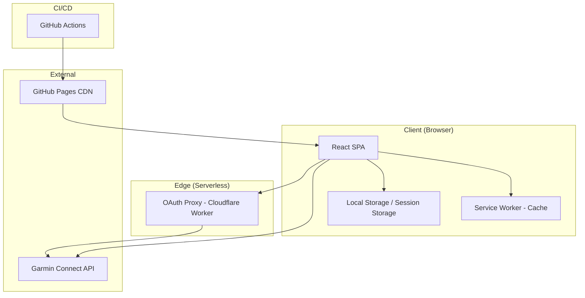
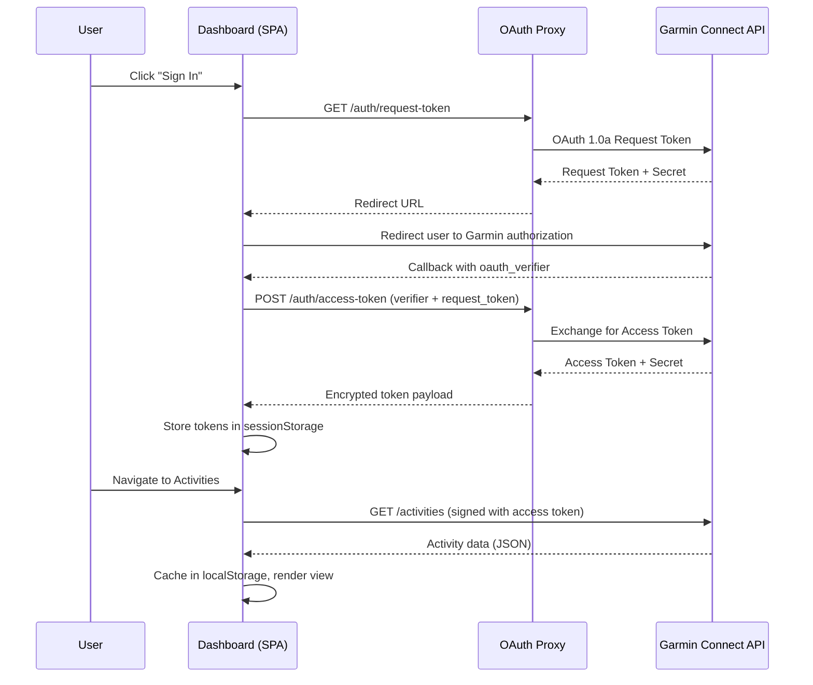
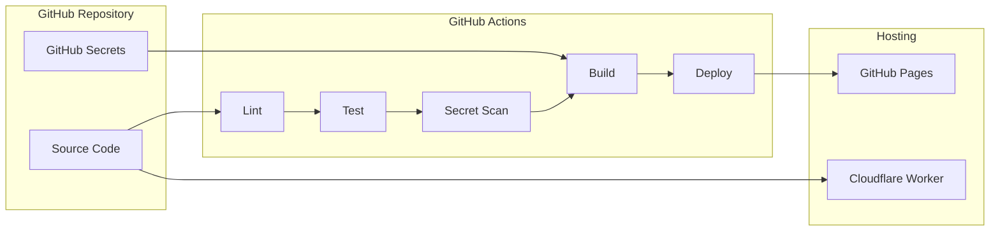
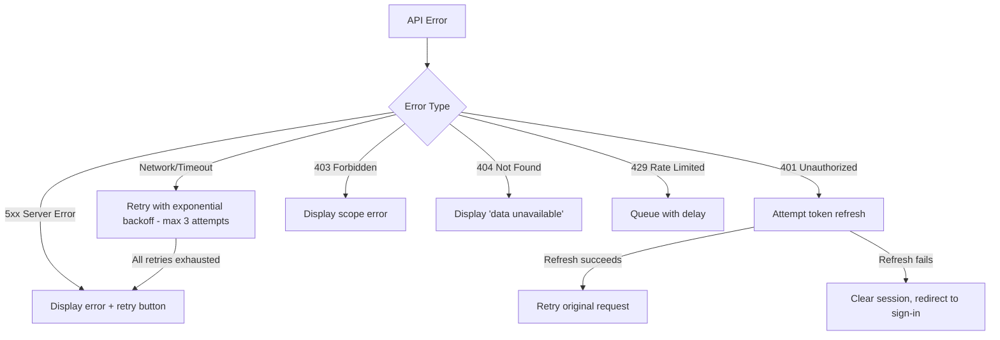
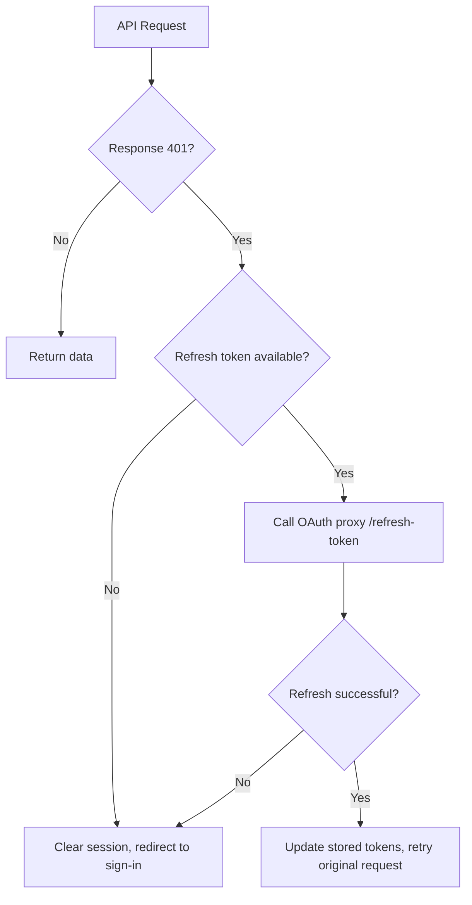

# Design Document: Garmin Fitness Dashboard

## Overview

The Garmin Fitness Dashboard is a client-side Single Page Application (SPA) that connects to Garmin Connect via OAuth 1.0a to retrieve, display, and enrich user fitness data. The application combines features from Garmin Connect and Strava into a unified dashboard, adds derived insights by combining multiple metrics, and provides animated exercise visualizations.

### Key Design Decisions

1. **React + TypeScript + Vite**: React 19 with TypeScript for type safety, Vite for fast builds and native code splitting. This satisfies the <200KB initial bundle requirement (Req 8.3) and provides excellent developer experience.

2. **OAuth Proxy via Cloudflare Worker**: A serverless function handles OAuth 1.0a token exchange securely without exposing consumer secrets in client code. Cloudflare Workers provide global edge deployment with minimal cold-start latency.

3. **TanStack Query for data fetching**: Provides caching, background refresh, pagination, and error handling out of the box — addressing requirements for session caching (Req 2.6) and loading states (Req 2.5, 3.7).

4. **Zustand for global state**: Lightweight state management for auth session, user preferences, and cross-view state (Req 8.7).

5. **Recharts for data visualization**: A React-native charting library built on D3 that supports responsive time-series charts, custom tooltips, and accessibility.

6. **SVG + CSS Keyframe animations for exercises**: Browser-native approach using inline SVGs with CSS animation classes, meeting Req 7.4 without external runtime dependencies.

7. **Leaflet for maps**: Lightweight, open-source map library for rendering GPS routes (Req 4.4).

## Architecture

### High-Level System Architecture



### Request Flow



### Deployment Architecture



## Components and Interfaces

### Application Component Tree

```
App
├── AuthProvider (context)
│   ├── ThemeProvider (light/dark)
│   │   ├── Layout
│   │   │   ├── NavigationBar / HamburgerMenu
│   │   │   ├── RouterOutlet
│   │   │   │   ├── SignInPage
│   │   │   │   ├── DashboardOverview
│   │   │   │   ├── ActivitiesView
│   │   │   │   │   ├── ActivityList
│   │   │   │   │   ├── ActivityDetail
│   │   │   │   │   └── ActivityMap
│   │   │   │   ├── DailySummaryView
│   │   │   │   │   ├── MetricsChart
│   │   │   │   │   └── DateRangePicker
│   │   │   │   ├── TrainingCalendarView
│   │   │   │   ├── InsightsView
│   │   │   │   │   ├── InsightCard
│   │   │   │   │   └── InsightTrendChart
│   │   │   │   ├── PerformanceView
│   │   │   │   │   ├── PersonalRecords
│   │   │   │   │   ├── TrainingStatus
│   │   │   │   │   ├── FitnessAndFreshness
│   │   │   │   │   └── YearOverYear
│   │   │   │   └── ExerciseLibrary
│   │   │   │       └── ExerciseAnimation
│   │   │   └── Footer
```

### Core Module Structure

```
src/
├── main.tsx                    # Entry point
├── App.tsx                     # Root with providers
├── router.tsx                  # Route definitions (lazy-loaded)
├── components/
│   ├── layout/                 # Shell, nav, responsive layout
│   ├── charts/                 # Reusable chart components
│   ├── maps/                   # GPS route map components
│   ├── animations/             # Exercise SVG animations
│   └── ui/                     # Shared UI primitives
├── features/
│   ├── auth/                   # OAuth flow, token management
│   ├── activities/             # Activity list, detail, pagination
│   ├── daily-summary/          # Health metrics, daily data
│   ├── training/               # Calendar, personal records, status
│   ├── insights/               # Enriched data calculations
│   └── performance/            # Strava-like features
├── services/
│   ├── garmin-api.ts           # Garmin Connect API client
│   ├── oauth-proxy.ts          # OAuth proxy communication
│   └── cache.ts                # Local storage cache layer
├── stores/
│   ├── auth-store.ts           # Auth state (Zustand)
│   └── preferences-store.ts   # User preferences (units, theme)
├── utils/
│   ├── crypto.ts               # Token encryption/decryption
│   ├── calculations.ts         # Enriched insight algorithms
│   └── formatters.ts           # Data formatting utilities
├── types/
│   └── garmin.ts               # TypeScript interfaces for API data
└── assets/
    └── animations/             # SVG exercise animation files
```

### Key Interfaces

```typescript
// OAuth Proxy Interface
interface OAuthProxyAPI {
  getRequestToken(): Promise<{ redirectUrl: string; requestToken: string }>;
  exchangeAccessToken(params: {
    requestToken: string;
    oauthVerifier: string;
  }): Promise<EncryptedTokenPayload>;
  refreshToken(params: {
    encryptedRefreshToken: string;
  }): Promise<EncryptedTokenPayload>;
}

// Garmin API Client Interface
interface GarminAPIClient {
  getActivities(params: { start: number; limit: number }): Promise<Activity[]>;
  getActivityDetail(activityId: string): Promise<ActivityDetail>;
  getDailySummary(params: { startDate: string; endDate: string }): Promise<DailySummary[]>;
  getPersonalRecords(): Promise<PersonalRecord[]>;
  getTrainingStatus(): Promise<TrainingStatus>;
  getUserProfile(): Promise<UserProfile>;
}

// Cache Service Interface
interface CacheService {
  get<T>(key: string, userId: string): T | null;
  set<T>(key: string, userId: string, data: T, ttl?: number): void;
  clear(userId: string): void;
  clearAll(): void;
}

// Insight Calculator Interface
interface InsightCalculator {
  calculateTrainingIntensity(activity: ActivityDetail): number;
  calculateAerobicEfficiency(activity: ActivityDetail): number;
  calculateRecoveryReadiness(data: {
    restingHRTrend: number[];
    sleepQuality: number;
    bodyBattery: number;
  }): number;
  calculateWeeklyBalance(weekActivities: Activity[]): number;
  classifyOvertrainingRisk(data: {
    trainingLoadTrend: number[];
    recoveryTime: number;
    sleepQuality: number;
    hrv: number[];
  }): 'low' | 'moderate' | 'high';
}

// Exercise Animation Interface
interface ExerciseAnimationConfig {
  id: string;
  name: string;
  muscleGroups: string[];
  svgContent: string;
  animationDuration: number; // 2-6 seconds
  cssClass: string;
}
```

### OAuth Proxy API Endpoints

| Endpoint | Method | Description |
|----------|--------|-------------|
| `/auth/request-token` | GET | Initiates OAuth 1.0a flow, returns redirect URL |
| `/auth/access-token` | POST | Exchanges verifier for access token |
| `/auth/refresh-token` | POST | Refreshes expired access token |
| `/health` | GET | Health check endpoint |

The proxy validates the `Origin` header against an allowlist (Req 11.3) and returns 403 for unauthorized domains (Req 11.5).

## Data Models

### Core Domain Models

```typescript
// User and Authentication
interface UserProfile {
  userId: string;
  displayName: string;
  profileImageUrl?: string;
}

interface AuthSession {
  userId: string;
  displayName: string;
  accessToken: string;       // Encrypted
  tokenSecret: string;       // Encrypted
  refreshToken: string;      // Encrypted
  expiresAt: number;         // Unix timestamp
}

// Activities
interface Activity {
  activityId: string;
  activityType: ActivityType;
  activityName: string;
  startTime: string;         // ISO 8601
  duration: number;          // seconds
  distance?: number;         // meters
  calories?: number;
  averageHR?: number;
  maxHR?: number;
  elevationGain?: number;
  hasGPS: boolean;
}

type ActivityType =
  | 'running' | 'cycling' | 'swimming' | 'walking'
  | 'hiking' | 'strength_training' | 'yoga' | 'other';

interface ActivityDetail extends Activity {
  heartRateZones?: HeartRateZone[];
  pace?: PaceData[];          // per-km/mile splits
  cadence?: CadenceData[];
  elevation?: ElevationData[];
  gpsRoute?: GPSPoint[];
  exercises?: ExerciseSet[];  // For strength training
}

interface HeartRateZone {
  zone: number;              // 1-5
  minHR: number;
  maxHR: number;
  timeInZone: number;        // seconds
  percentageInZone: number;
}

interface GPSPoint {
  lat: number;
  lon: number;
  elevation?: number;
  timestamp: string;
  heartRate?: number;
  pace?: number;
}

interface ExerciseSet {
  exerciseName: string;
  exerciseId?: string;
  sets: number;
  reps: number;
  weight?: number;
  duration?: number;
}

// Daily Summary
interface DailySummary {
  date: string;              // YYYY-MM-DD
  steps: number;
  restingHeartRate?: number;
  sleepDuration?: number;    // minutes
  sleepStages?: SleepStages;
  stressLevel?: number;      // 0-100
  bodyBattery?: number;      // 0-100
  respirationRate?: number;
  vo2Max?: number;
  trainingLoad?: number;
  recoveryTime?: number;     // hours
}

interface SleepStages {
  deep: number;              // minutes
  light: number;
  rem: number;
  awake: number;
}

// Training & Performance
interface PersonalRecord {
  recordType: string;        // 'longest_run', 'fastest_5k', etc.
  value: number;
  unit: string;
  activityId: string;
  date: string;
}

interface TrainingStatus {
  vo2Max: number;
  trainingLoad: number;
  trainingLoadBalance: 'optimal' | 'overreaching' | 'detraining';
  recoveryTimeHours: number;
}

// Enriched Insights
interface EnrichedInsight {
  type: InsightType;
  value: number;             // 0-100 normalized or categorical
  label: string;
  description: string;
  contributingMetrics: ContributingMetric[];
  calculatedAt: string;
  insufficientData: boolean;
  missingMetrics: string[];
}

type InsightType =
  | 'training_intensity'
  | 'aerobic_efficiency'
  | 'recovery_readiness'
  | 'weekly_balance'
  | 'overtraining_risk';

interface ContributingMetric {
  name: string;
  value: number;
  unit: string;
  weight: number;            // Influence weight 0-1
}

// User Preferences
interface UserPreferences {
  unitSystem: 'metric' | 'imperial';
  theme: 'light' | 'dark' | 'system';
  defaultDateRange: 7 | 30 | 90;
}
```

### Local Storage Schema

All storage keys are prefixed with the user's Garmin ID for multi-user isolation (Req 10.1):

```
{userId}:auth_session        → AuthSession (encrypted, sessionStorage)
{userId}:activities_cache    → Activity[] (localStorage)
{userId}:daily_summary_cache → Record<string, DailySummary> (localStorage)
{userId}:preferences         → UserPreferences (localStorage)
{userId}:insights_cache      → EnrichedInsight[] (localStorage)
```

### Enriched Insight Calculation Formulas

| Insight | Inputs | Formula (normalized 0-100) |
|---------|--------|---------------------------|
| Training Intensity | HR zone distribution, duration, activity type | `(weightedZoneTime / maxPossible) × typeMultiplier × 100` |
| Aerobic Efficiency | Pace, average HR (running only) | `(pace / avgHR) × calibrationFactor × 100` |
| Recovery Readiness | 7-day resting HR trend, sleep quality, body battery | `(sleepScore × 0.3 + batteryScore × 0.4 + hrTrendScore × 0.3)` |
| Weekly Balance | Activity types, durations, intensity distribution | `1 - stddev(categoryMinutes) / mean(categoryMinutes) × 100` |
| Overtraining Risk | Training load trend, recovery, sleep, HRV | Threshold classifier: low/moderate/high |


## Correctness Properties

*A property is a characteristic or behavior that should hold true across all valid executions of a system — essentially, a formal statement about what the system should do. Properties serve as the bridge between human-readable specifications and machine-verifiable correctness guarantees.*

### Property 1: Token Storage Round Trip

*For any* valid OAuth token payload (access token, token secret, refresh token), encrypting and storing the payload in session storage, then reading it back and decrypting, SHALL produce a payload identical to the original.

**Validates: Requirements 1.3**

### Property 2: Pagination Correctness

*For any* list of N activities and any page number P with page size S (50 for activities view, 20 for feed view), the returned page SHALL contain exactly `min(S, N - P*S)` items when `P*S < N`, and zero items when `P*S >= N`, and the items SHALL be in reverse-chronological order.

**Validates: Requirements 2.1, 5.2**

### Property 3: Activity Display Completeness

*For any* activity with non-null type, date, duration, and distance fields, the rendered activity card (in both list and feed views) SHALL contain string representations of all four fields.

**Validates: Requirements 2.2, 5.1**

### Property 4: Cache Round Trip

*For any* user ID and activity data set, after caching the data via the cache service, a subsequent read with the same user ID and cache key SHALL return data identical to the original without triggering an API call.

**Validates: Requirements 2.6**

### Property 5: Partial Data Graceful Rendering

*For any* activity detail where any subset of optional metric fields (heart rate zones, cadence, elevation, GPS route) is null or undefined, the render function SHALL produce valid output containing only the available metrics and SHALL NOT throw an error.

**Validates: Requirements 2.7, 5.7**

### Property 6: Daily Summary Field Presence

*For any* daily summary object containing steps, resting heart rate, sleep duration, sleep stages, stress level, body battery, and respiration rate, the rendered output SHALL include a representation of each field.

**Validates: Requirements 3.2**

### Property 7: Time-Series Aggregation Correctness

*For any* array of daily summary data points and any granularity setting (day, week, month), the aggregation function SHALL group data points into non-overlapping intervals matching the granularity, and the sum of items across all groups SHALL equal the total number of input data points.

**Validates: Requirements 3.4**

### Property 8: Date Range to API Parameter Mapping

*For any* valid date range selection where the range is between 1 and 90 days, the generated API request parameters SHALL have a start date and end date that exactly match the selected range boundaries.

**Validates: Requirements 3.3**

### Property 9: Calendar Activity Placement

*For any* set of activities within a given month, each activity SHALL appear on the calendar cell corresponding to its start date, and the calendar cell SHALL display the activity's type and duration.

**Validates: Requirements 4.1**

### Property 10: GPS Route Segmentation

*For any* GPS route with total distance D and target segment length L (1 km or 1 mile), the segmentation function SHALL produce approximately `ceil(D/L)` segments where each segment's distance is within 15% of L (except possibly the last segment), and each segment SHALL have associated pace and elevation values.

**Validates: Requirements 5.3**

### Property 11: Training Summary Totals Invariant

*For any* set of activities within a week or month, the training summary's total distance SHALL equal the sum of individual activity distances, total time SHALL equal the sum of durations, total elevation SHALL equal the sum of elevation gains, and activity count SHALL equal the number of activities.

**Validates: Requirements 5.4**

### Property 12: Cumulative Year-Over-Year Monotonicity

*For any* year of activity data, the cumulative distance and cumulative activity count functions SHALL be monotonically non-decreasing over time within that year.

**Validates: Requirements 5.5**

### Property 13: Fitness and Freshness Calculation Model

*For any* sequence of daily training load values over a 90-day window, the fitness value SHALL equal the exponentially-weighted moving average with the configured time constant, and the freshness value SHALL equal fitness minus fatigue, both computed without error for any non-negative training load inputs.

**Validates: Requirements 5.6**

### Property 14: Enriched Insight Normalization Bounds

*For any* valid combination of input metrics, the training intensity, aerobic efficiency, recovery readiness, and weekly training balance calculations SHALL each produce a value in the closed interval [0, 100].

**Validates: Requirements 6.1, 6.2, 6.3, 6.4**

### Property 15: Overtraining Risk Classification Invariant

*For any* valid combination of training load trend, recovery time, sleep quality, and heart rate variability values, the overtraining risk classifier SHALL return exactly one of 'low', 'moderate', or 'high'.

**Validates: Requirements 6.5**

### Property 16: Contributing Metrics Display Completeness

*For any* calculated enriched insight, the rendered output SHALL include the name and value of every contributing metric used in the calculation alongside the derived value.

**Validates: Requirements 6.6**

### Property 17: Missing Metrics Identification

*For any* enriched insight calculation where one or more required contributing metrics are unavailable, the system SHALL correctly identify all missing metric names and SHALL NOT produce a calculated value for that insight.

**Validates: Requirements 6.8**

### Property 18: Exercise Animation Matching

*For any* strength training activity containing a list of exercises, and given a known animation library, the system SHALL display the matching animation for each exercise that has a corresponding entry in the library, and a placeholder for those that do not.

**Validates: Requirements 7.2, 7.3**

### Property 19: Exercise Hover Metadata Correctness

*For any* exercise animation configuration, when hover/selection interaction occurs, the displayed metadata SHALL include the exact exercise name, all target muscle groups, and the rep/set count from the activity data.

**Validates: Requirements 7.5**

### Property 20: Navigation State Preservation

*For any* sequence of view navigations within the SPA, the authentication status and global filter state SHALL remain unchanged after each navigation event.

**Validates: Requirements 8.7**

### Property 21: User Data Isolation

*For any* pair of distinct user IDs (A, B), when user B signs in after user A, all local storage and session storage entries prefixed with user A's identifier SHALL be removed, and no data from user A SHALL be accessible to user B.

**Validates: Requirements 10.1, 10.2**

### Property 22: Origin Allowlist Enforcement

*For any* HTTP request to the OAuth proxy, if the request's Origin header matches an entry in the configured allowlist, the proxy SHALL process the request; if the Origin does not match any allowlist entry, the proxy SHALL reject the request with HTTP status 403.

**Validates: Requirements 11.3, 11.5**

### Property 23: Accessibility Labels Presence

*For any* rendered exercise animation element or chart visualization in the DOM, the element SHALL have either a non-empty `alt` attribute or a non-empty `aria-label` attribute.

**Validates: Requirements 12.3**

### Property 24: Touch Target Minimum Size

*For any* interactive element (button, link, control) rendered at viewport widths below 768px, the element's computed click area SHALL be at least 44px in width and 44px in height.

**Validates: Requirements 12.6**

## Error Handling

### Error Handling Strategy

The application uses a layered error handling approach:



### Error Categories and Responses

| Error Type | Source | User-Facing Response | Recovery |
|------------|--------|---------------------|----------|
| Auth failure | OAuth proxy | "Authentication failed" + retry button | Retry OAuth flow |
| Token expired | API 401 | Silent refresh attempt, then re-auth prompt | Auto-refresh → sign-in redirect |
| API error (4xx) | Garmin API | "Unable to load [data type]" + retry button | Manual retry |
| API error (5xx) | Garmin API | "Service temporarily unavailable" + retry button | Exponential backoff retry |
| Network error | Fetch failure | "No internet connection" + retry button | Auto-retry on reconnect |
| Missing data | Garmin API | Placeholder: "No data available for [section]" | None needed |
| Partial data | Garmin API | Render available metrics, omit unavailable | None needed |
| Insufficient insight data | Calculation | "Insufficient data (need 3+ days)" message | Accumulate more data |
| Missing insight metrics | Calculation | List missing metrics, no calculated value | Wait for data sync |
| Browser unsupported | Feature detection | "Please update your browser" message | User action required |
| Build secret missing | CI/CD | Build fails with specific error message | Fix secrets configuration |
| Unauthorized origin | OAuth proxy | 403 response (not user-facing) | Configuration fix |

### Error Boundary Architecture

```typescript
// Global error boundary wraps the entire app
<ErrorBoundary fallback={<CriticalErrorPage />}>
  <App />
</ErrorBoundary>

// View-level error boundaries isolate failures
<ErrorBoundary fallback={<ViewErrorCard onRetry={refetch} />}>
  <ActivityFeedView />
</ErrorBoundary>

// Component-level boundaries for independent widgets
<ErrorBoundary fallback={<MetricUnavailable metric="VO2 Max" />}>
  <TrainingStatusWidget />
</ErrorBoundary>
```

### Retry Strategy

```typescript
const retryConfig = {
  maxRetries: 3,
  baseDelay: 1000,        // 1 second
  maxDelay: 30000,        // 30 seconds
  backoffMultiplier: 2,   // Exponential backoff
  retryableStatuses: [408, 429, 500, 502, 503, 504],
};
```

### Token Refresh Flow



## Testing Strategy

### Testing Pyramid

```
         /  E2E Tests  \        ← Playwright (critical user paths)
        / Integration    \      ← MSW + React Testing Library
       / Property Tests    \    ← fast-check (24 properties, 100+ iterations each)
      / Unit Tests           \  ← Vitest (pure functions, utilities)
     /________________________\
```

### Technology Stack

| Layer | Tool | Purpose |
|-------|------|---------|
| Unit tests | Vitest | Pure function testing, utility testing |
| Property tests | fast-check + Vitest | Universal property verification (100+ iterations) |
| Component tests | React Testing Library | Component rendering, interaction |
| Integration tests | MSW (Mock Service Worker) | API mocking for data flow testing |
| E2E tests | Playwright | Critical user journey validation |
| Accessibility | axe-core + Lighthouse | WCAG 2.1 AA automated checks |
| Performance | Lighthouse CI | Bundle size and performance scoring |
| Secret scanning | Gitleaks | Prevent credential exposure |

### Property-Based Testing Configuration

Each property test uses the [fast-check](https://github.com/dubzzz/fast-check) library with a minimum of 100 iterations per property. Tests are tagged with the corresponding design property:

```typescript
// Example: Property 14 - Enriched Insight Normalization Bounds
// Feature: garmin-fitness-dashboard, Property 14: Enriched Insight Normalization Bounds
test.prop(
  [validHeartRateZonesArb, fc.integer({ min: 60, max: 7200 }), activityTypeArb],
  (zones, duration, type) => {
    const score = calculateTrainingIntensity(zones, duration, type);
    expect(score).toBeGreaterThanOrEqual(0);
    expect(score).toBeLessThanOrEqual(100);
  },
  { numRuns: 100 }
);
```

### Custom Generators

Key generators needed for property tests:

- **activityArb**: Generates valid Activity objects with random types, dates, durations, distances
- **activityDetailArb**: Extends activityArb with optional metrics (random subsets null)
- **dailySummaryArb**: Generates valid DailySummary with random metric values in realistic ranges
- **gpsRouteArb**: Generates realistic GPS point sequences forming valid routes
- **heartRateZonesArb**: Generates valid 5-zone HR distributions that sum to total activity duration
- **oauthTokensArb**: Generates random token strings for auth testing
- **originHeaderArb**: Generates random origin URLs for allowlist testing

### Test Coverage Targets

| Category | Target | Rationale |
|----------|--------|-----------|
| Calculation utils (insights, segmentation, aggregation) | 95% | Core business logic |
| API client layer | 80% | Integration boundaries |
| UI components | 70% | Rendering correctness |
| Overall | 80% | Balance coverage with maintainability |

### Unit Test Focus Areas

- Enriched insight calculation functions (all 5 metrics)
- GPS segmentation algorithm
- Time-series aggregation (day/week/month)
- Pagination logic
- Token encryption/decryption
- Cache service (read/write/clear/prefix logic)
- Date range utilities
- Fitness and freshness exponential decay

### Integration Test Focus Areas

- OAuth flow end-to-end (with mock proxy)
- Activity data retrieval and caching
- Daily summary retrieval with date ranges
- Multi-user sign-in/sign-out isolation
- Error response handling from API

### E2E Test Critical Paths

1. Sign in → view activities → view detail → sign out
2. Sign in → daily summary → change date range → verify charts
3. Sign in → insights view → verify calculations display
4. Sign in → strength activity → exercise animations render
5. Mobile responsive: navigation collapses at 768px breakpoint

### CI/CD Test Integration

```yaml
# GitHub Actions workflow steps (order)
steps:
  - lint (ESLint + Prettier)
  - type-check (tsc --noEmit)
  - secret-scan (Gitleaks)
  - unit-tests (Vitest --run)
  - property-tests (Vitest --run with fast-check)
  - build (Vite build)
  - bundle-size-check (< 200KB gzip)
  - lighthouse-ci (score >= 80)
  - deploy (GitHub Pages)
```
