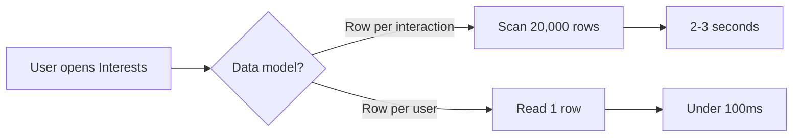

TITLE: Intelligent Strategies to Build a Zero(0) Infrastructure Cost Matrimony App 
DATE: 2026-04-03 
AUTHOR: Vaishakh Kuppast 
TAGS: Google, Appscripts, Serverless, Zero-Cost, Open Source 
IMAGE: https://github.com/user-attachments/assets/bfadd132-699b-4825-8bac-ea90979735d0

# Intelligent Strategies to Build a Zero(0) Infrastructure Cost, Matrimony App

What does it take to serve a thousand users when you can't afford a single server?

Not "can't afford" in the startup sense, where you're waiting for funding. I mean literally zero budget. No database. No hosting. No monthly bill of any kind. Just Google's free tier: Sheets for data, Drive for photos, Apps Script for logic. Three files. A spreadsheet pretending to be a backend.

rishtas.in started as a simple idea: build a free matrimonial platform for a community that couldn't justify paying ₹5,000 to see a phone number on existing platforms. The features were straightforward. The constraint was not. And the strategies I had to develop to make a spreadsheet-backed app feel fast, stay secure, and treat users fairly turned out to be far more interesting than the features themselves.

This is the story of those strategies: how each one emerged from a specific problem, and what I learned about performance when every assumption about infrastructure is off the table.

**Live:** [rishtas.github.io](https://rishtas.github.io)


---

## Why a Spreadsheet Backed App ? The Origin Story

The idea started with a conversation at a family gathering. Someone mentioned how expensive matrimonial platforms had become. ₹5,000 just to see a phone number. ₹10,000 for "premium" features. For families in smaller towns, especially in communities where matchmaking has always been a collective, informal process, these prices felt extractive.

I said, half-jokingly, "I could build one for free." And then I couldn't stop thinking about it.

The first thing I did was list what a matrimonial platform actually needs: user profiles with photos, a way to browse and filter, a shortlist, a way to express interest, and the ability to share contact details once both sides agree. That's it. No AI matching. No video calls. No premium tiers. Just the digital equivalent of what aunties have been doing at weddings for centuries.

The second thing I did was list what I couldn't spend money on: everything. No domain hosting fees. No database subscriptions. No cloud compute bills. The platform had to be free to run, because the moment it costs money, someone has to pay, and then we're back to the problem we're trying to solve.

So I started eliminating options. Firebase? Free tier is generous, but Firestore has daily limits that would bite at scale. A VPS? Even the cheapest is ₹500/month. Heroku free tier? Gone. Vercel? Great for static sites, but I need a database.

Then I looked at what I already had for free. Every Google account comes with Sheets (10 million cells), Drive (15GB storage), and Apps Script (server-side JavaScript with free execution). Sheets can store structured data. Drive can store files. Apps Script can serve HTML and run backend logic.

Could a spreadsheet actually be a database? Not a good one. Not a fast one. But a *functional* one? I opened a blank Sheet, typed "Email, Password, Name, Age, Gender" across the first row, and started building.

The thing about spreadsheets that nobody talks about in engineering circles is that they're *transparent*. You can open the Sheet and see every user, every interaction, every piece of data. There's no abstraction layer. No ORM. No query language. Just rows and columns that a non-technical community elder can understand. For a platform built on trust, where a known person in the community is managing the data, that transparency turned out to be a feature I didn't plan for.

Apps Script's `HtmlService` can serve a full HTML page, meaning when someone visits your deployed URL, Google's servers hand them your HTML file directly, no hosting needed. The frontend communicates with the backend through `google.script.run`, which is essentially a bridge: your webpage calls a JavaScript function, and that function executes on Google's servers with full access to your Sheets and Drive. It's like having an API endpoint, except you didn't set up a server. Google did it for you.

The entry point is a function called `doGet()`. When someone opens your web app URL, Google Apps Script calls `doGet()`, which returns your HTML page. Think of it as the front door: every visitor knocks on `doGet()`, and it hands them the app.

Google Drive's file API lets you upload and serve images. Stitch these together and you have a three-file full-stack application: `main.html` for the landing page, `index.html` for the app, `code.gs` for the backend. No build step. No deployment pipeline. Paste the code, click deploy, share the URL.

The architecture looks absurd on paper. It looked absurd to me when I started. But it works. The question was never whether it could work. The question was whether it could work *well enough* that users wouldn't notice the spreadsheet underneath.

---

## The Problem Nobody Warns You About

Think about what happens when you open any social app. You see a feed. Behind that feed is a database query that took maybe 2 milliseconds, hitting an index, returning 20 rows.

Now imagine that same feed, except every time you open it, the app reads *every record ever created*, loads it all into memory, loops through it, and picks the ones relevant to you. That's how reading data from Google Sheets works. The command is `getDataRange().getValues()`, and it does exactly what it sounds like: get the entire data range, get all the values. There's no "WHERE clause." There's no "LIMIT 20." There's no index to speed things up. You ask for data, you get *all* of it, every row, every column, every time.

With 50 users, nobody notices. With 500, it takes 2-3 seconds. With 1000, you're staring at a loading screen wondering if the app crashed.

I didn't realize this until real users started complaining. The app worked perfectly in testing with 10 profiles. The moment the community started signing up, everything slowed to a crawl. That's when I understood: the challenge wasn't building features on Sheets. It was making Sheets *disappear* behind those features.

What follows are the strategies I developed to solve that. Some came from research. Most came from watching something break and asking "why is this slow?"

---

## Turning Rows Into Columns

The first thing that broke was the interactions model. When User A sends an interest to User B, the textbook approach is one row per interaction: sender, receiver, timestamp, status. Clean. Relational. Exactly what you'd do in Postgres.

But I'm not in Postgres. Every time User A opens their inbox, the app calls `getDataRange().getValues()` on the Interests sheet. That returns *every row*. With 1000 users averaging 20 interactions each, that's 20,000 rows loaded into memory just to find the 20 that belong to User A.

I kept thinking about this like a filing cabinet. The row-per-interaction model is like having one giant drawer where everyone's letters are mixed together. Every time you want your mail, you dump the entire drawer on the floor and sort through it.

What if each person had their own drawer? One row per user, with their interactions growing sideways:

```
| UserA | UserB | Jan-15 | Sent | UserC | Jan-20 | Received | ...
```

Finding User A's interactions: read one row. Done. The scan goes from 20,000 rows to 1.

The tradeoff hit me when I tried to delete an interaction. You can't just remove cells from the middle of a row in Sheets without leaving gaps. So I had to read the entire row, rebuild it in memory without the deleted entry, pad it with empty strings, and write the whole thing back. More complex code, but one API call instead of a table scan.

I asked myself: how often do users read their interactions versus delete them? Reads happen every time they open the app. Deletes happen maybe once a week. Optimizing for the frequent operation was the obvious choice, but I only saw it after building the wrong thing first.



The non-obvious thing here: the horizontal model has a ceiling. Past ~200 interactions per user, the row gets unwieldy. But on a matrimonial platform, nobody has 200 active interests. The constraint of the model matches the constraint of the domain. I got lucky with that, honestly.

---

## The Five Caches I Didn't Plan to Build

I didn't set out to build five caching layers. I built one, found it wasn't enough, added another, and kept going until the performance was acceptable. Looking back, each layer solves a distinct problem, and removing any one of them creates a noticeable regression.

**The first cache was obvious.** Within a single Apps Script execution, I might need the Profiles sheet three times: once to find the user, once to build the browse list, once to resolve wishlist entries. Each `getData()` call reads the entire sheet. So I wrapped it in a variable: read once, return the cached copy on subsequent calls within the same execution. Simple. Cut redundant reads by 60%.

**The second cache came from watching server logs.** User A logs in, and the app builds a profile map (a lookup table that maps each user's ID to their profile data). User B logs in 30 seconds later and builds the exact same map from scratch. Same data, same computation, wasted twice.

Google provides something called `CacheService`, a built-in key-value store that lives on Google's servers and is shared across all users of your script. It has a 6-hour time-to-live: you store something, and it's available to everyone for 6 hours before it expires. I serialize the profile map to JSON and store it there. Now User A pays the cost of building the map, and Users B through Z for the next 6 hours get it from cache. The Sheets read that took 2 seconds becomes a cache hit that takes 50 milliseconds.

**The third cache was the one that changed everything.** I was watching my friend browse the app on her phone. She'd open it, wait 3 seconds for profiles to load, scroll through them, close the app, open it 10 minutes later, and wait 3 seconds again. Same profiles. Same data. Nothing had changed. But the app fetched everything from scratch every single time.

That's when I started thinking about localStorage. What if the browser remembered the profiles it already had? The key insight was that profiles don't change every minute. Someone registers or edits their profile maybe a few times a day. So the frontend checks: "Is my cached data from today?" If yes, render from cache instantly. Zero server calls. If no, fetch fresh.

The difference was dramatic. Returning users went from a 3-second wait to seeing profiles in under 100 milliseconds. The app felt like a native app instead of a web page talking to a spreadsheet.

**The fourth cache was about privacy.** I realized that localStorage stores data as plain text. Anyone who opened DevTools could see names, locations, community details of every profile. That felt wrong. So I added XOR encryption using the session token as the key, with base64 encoding on top. It's not military-grade cryptography, but it means the data is unreadable without an active login session. The encryption adds about 1 millisecond of overhead on 100KB of data. I measured it. Imperceptible.

**The fifth cache was the subtlest.** Even with localStorage, the app still checked the server for updates to wishlists and interests. Sometimes the server would say "yes, there's new data," the app would fetch it, and the data would be identical to what was already cached. The UI would re-render for nothing.

So I added a JSON comparison: after fetching fresh data, stringify it and compare against the cached version. Only re-render if they actually differ. This eliminated phantom re-renders that made the interface flicker when nothing had changed.

Each cache layer took maybe an hour to implement. Together, they transformed the app from "painfully slow spreadsheet wrapper" to "surprisingly fast, how is this running on Sheets?"

---

## The Fairness Problem I Almost Ignored

Here's something I didn't think about until a user pointed it out: "Why do I always see the same people at the top?"

If profiles are stored in the order they registered, the earliest users always appear first. On a matrimonial platform, that's not just a UX issue. It's a fairness issue. The people at the top get disproportionate attention, and the people at the bottom might never be seen.

The obvious fix is to shuffle the profiles on the server. But I'd just spent all this effort caching profiles in localStorage to avoid server calls. If I shuffle on the server, every page load needs a fresh server call to get the new order. That defeats the entire caching strategy.

I sat with this for a while. Then I realized: the shuffle doesn't need to be random. It needs to be *different each day* but *consistent within a day*. If everyone sees the same shuffled order today, and a different shuffled order tomorrow, that's fair enough.

A seeded Fisher-Yates shuffle does exactly this. I use the date as the seed: `YYYYMMDD` becomes a number that drives the shuffle algorithm. Same date, same seed, same order. Tomorrow, different seed, different order. And because it runs on cached data in the browser, it costs zero server calls.

The part that surprised me: users noticed. Not the shuffle itself, but the effect. "I'm seeing new people today!" Yes. You are. Because yesterday's first page is today's fifth page, and vice versa.

---

## Why Your Phone Number Shouldn't Be in My Browser

This one keeps me up at night a little, because I almost shipped it wrong.

In the early version, every profile object sent to the browser included the user's phone number. Every single one. If you opened DevTools on the Discover page, you could see the phone numbers of every person on the platform, whether they'd accepted your interest or not.

I caught this during a security review I was doing on my own code. The question I asked was: "What data does the browser have that it doesn't need?" The answer was: phone numbers for 99% of the profiles shown.

The fix was to remove the phone field from the shared profile map entirely. The map that powers browse cards, wishlist cards, and interest cards simply doesn't have a phone field. It can't leak what it doesn't contain.

Phone numbers are injected in exactly one place: the `getUserInterests()` function, and only when the status is `Accepted`. The server checks the condition before including the data. If the interest isn't mutually accepted, the phone number never leaves the server.

```javascript
if (status === STATUS_ACCEPTED && phoneMap[rid]) {
  entry.phone = phoneMap[rid];
}
```

This is a small code change but a significant architectural decision. It moves phone number access from a frontend display decision ("show the phone button only for accepted interests") to a server-side access control decision ("the data doesn't exist in the browser unless the condition is met"). The difference matters because frontend controls can be bypassed. Server-side controls can't.

I think about this pattern a lot now. Every time I send data to a client, I ask: does the client actually need all of this? Usually the answer is no.

---

## Making 5MB Photos Fit in a Free Tier

Google Drive gives you 15GB for free. That sounds like a lot until you do the math: 1000 users, 2 photos each, average phone photo at 5MB. That's 10GB. You've burned through two-thirds of your free tier on photos alone, and the app hasn't even been running for a year.

I needed to compress photos before they hit the server. The question was where. Server-side compression in Apps Script would mean uploading the full 5MB first, then compressing, then storing. That's slow and wasteful.

Client-side compression turned out to be surprisingly simple. The browser has a `<canvas>` element that can resize images and export them at any quality level. The function I wrote:

1. Reads the photo file into an `Image` element
2. Draws it onto a canvas at max 800px width (maintaining aspect ratio)
3. Exports as JPEG at 75% quality

A 5MB phone photo becomes roughly 150KB. That's a 33x reduction. The 10GB storage problem becomes a 300MB storage problem. And because the compressed image is what gets uploaded, the upload itself is faster too. Users on slow mobile connections noticed the difference immediately.

The quality loss at 800px and 75% JPEG? Invisible. The profile cards display photos at 340px height. You're compressing from 4000px to 800px for a display that's 340px. There's headroom to spare.

What I didn't expect: this also improved the browsing experience for everyone. Smaller photos mean faster card loading. A page of 20 profiles went from loading 100MB of images to loading 3MB. On a mobile connection, that's the difference between a 10-second wait and a 1-second wait.

---

## The Loading Screen That Wasn't

I had a full-screen loading animation. A pulsing heart with radiating rings and floating mini-hearts. It looked beautiful. Users hated it.

Not because it was ugly, but because it appeared *constantly*. Send an interest? Full-screen loader. Shortlist someone? Full-screen loader. Accept a request? Full-screen loader. Every action froze the entire interface for 1-2 seconds while a single Sheets write completed.

The insight came from watching how modern apps handle this. When you like a post on Instagram, the heart fills immediately. The server call happens in the background. If it fails, the heart un-fills. But you never see a loading screen for a like.

I couldn't do optimistic updates (too complex for this architecture), but I could do the next best thing: a non-blocking progress indicator. A slim gradient bar that slides under the navbar, with a contextual message: "Sending interest...", "Adding to shortlist...", "Accepting request..."

The user sees the bar, knows something is happening, and keeps browsing. When the action completes, the bar disappears and a subtle alert confirms it. The full-screen loader is now reserved for operations that genuinely block everything: initial login, first-time data fetch, account registration.

The server call takes the same amount of time. Nothing changed on the backend. But the perceived performance improved dramatically because the user's flow isn't interrupted. I learned that performance isn't just about milliseconds. It's about whether the user feels like they're waiting.

---

## Batch Writes: One Call Instead of Forty

This one is pure engineering, but the numbers are worth sharing.

In Apps Script, every time you want to change a cell in a Sheet, you call something like `sheet.getRange(row, column).setValue(data)`. That's one network round-trip to Google's servers. It goes over the internet, hits Google's infrastructure, writes the cell, and comes back. Fast for one cell. Catastrophic for forty.

When I remove an interaction from a user's horizontal row, the straightforward approach would be: clear the three cells (RID, date, status), then shift every subsequent triplet left to fill the gap, then clear the trailing empty cells. For a row with 20 interactions, that's roughly 40 individual `setValue()` calls. Forty round-trips to Google.

The optimized approach: read the row once into a JavaScript array, rebuild it in memory without the deleted entry, pad with empty strings, write the entire array back in one `setValues()` call. Notice the plural: `setValues()` (with an "s") writes an entire range at once. One network round-trip instead of forty.

I apply this pattern everywhere: interest deletion, status updates, wishlist modifications. Read once, compute in memory, write once. The code is slightly more complex, but when Sheets is under load from multiple concurrent users, the difference between 1 API call and 40 is the difference between "works" and "times out."

---

## Virtual Scrolling: Rendering 20 Cards, Not 500

After all the caching work, I had 500+ profiles sitting in the browser's memory, ready to display instantly. So I rendered all 500 as DOM nodes. The browser froze for about 2 seconds.

Each profile card has a glass-morphism blur effect, a gradient overlay, image galleries, animated borders, and box shadows. Multiply that by 500 and you're asking the browser to composite 500 complex visual elements simultaneously. Even modern phones struggle with that.

The fix was to render only what the user can see. I display 20 cards initially and place an invisible sentinel element at the bottom. An `IntersectionObserver` watches the sentinel with a 200px margin, meaning it triggers slightly before the user actually scrolls to the bottom. When it fires, I append the next 20 cards and move the sentinel down.

The user experiences infinite scroll. The DOM never has more than 40-60 cards at a time. Combined with `contain: content` on each card (which tells the browser that a card's layout doesn't affect anything outside it), scroll performance went from janky to smooth.

I also added `<link rel="preconnect">` hints for the image CDN and font servers, so DNS and TLS handshakes happen before any image is actually needed. Small optimization, maybe 200ms on the first photo load, but it's four lines of HTML for free performance.

---

## The Timestamp Trick That Ties It All Together

All these caching layers create a coordination problem. The browser has cached data. The server has fresh data. How does the browser know when to refresh?

I could check on every page load: "Hey server, has anything changed?" But that means reading the Profiles sheet (1000 rows) just to answer a yes/no question. That defeats the purpose of caching.

The solution is a tiny sheet called `Meta` with about 5 rows. Each row is a key-value pair: `profiles: 1712345678000`, `wishlist: 1712345690000`, `interests: 1712345700000`. The value is a timestamp of when that data type was last modified.

Every write operation updates the relevant timestamp. Every frontend load calls `getTimestamps()`, which reads 5 rows instead of 1000. The browser compares the server's timestamp against its local cache timestamp. If they match, nothing happens. If the server's is newer, it fetches fresh data.

This is the cheapest possible cache invalidation. The difference between reading 1000 rows and reading 5 rows is the difference between a 2-second call and a 50-millisecond call. And because the Meta sheet is tiny, it's fast even when Sheets is under load.

The pattern is simple, but getting it right required thinking about every write path in the application. Miss one `touchTimestamp()` call and users see stale data until the next day's cache refresh. I found two missing calls during testing. Both were in edge cases: declining an interest that was already accepted, and removing the last item from a wishlist.

---

## What I'd Do Differently

The XOR encryption on localStorage is obfuscation, not real security. A determined person with browser access could reverse it. If I were handling more sensitive data, I'd use the Web Crypto API with AES-GCM. But for names and locations that people voluntarily share on a matrimonial platform, the obfuscation is proportionate to the threat.

The horizontal data model works, but it makes debugging painful. When something goes wrong with a user's interests, I'm staring at a spreadsheet row with 60 columns trying to figure out which triplet is corrupted. A normalized model with proper indexing would be more maintainable. I chose read performance over developer experience, and some days I regret it.

If the community outgrows Sheets (past ~500 concurrent users), the move would be to Firebase Firestore's free tier. The frontend caching strategies would transfer directly since they're not Sheets-specific. But I'd lose the thing that makes this platform unique: you can literally open the spreadsheet and see all the data. For a community tool run by a trusted person, that transparency is a feature.

---

## The Question I Keep Coming Back To

Every strategy in this post exists because Google Sheets isn't a database. The caching, the horizontal model, the batch writes, the timestamp coordination: all of it is compensation for a fundamental architectural choice.

But that choice is also why this platform costs nothing to run. It's why anyone can fork it and deploy their own instance in five minutes. It's why the community elder who manages it can open a spreadsheet and understand exactly what's stored.

When I look at the twelve optimizations I built, I see clever engineering. But I also see twelve things that wouldn't exist if I'd just used a proper database. The question I can't resolve is whether the cleverness is the point or the problem.

If the constraints that force creative solutions are also the constraints that make the platform accessible, what happens when you remove them?

---

*Built by [Vaishakh I Kuppast](https://www.linkedin.com/in/vaishakh-i-kuppast). System Development Engineer at AWS, specializing in cloud architecture, security, and edge computing.*
